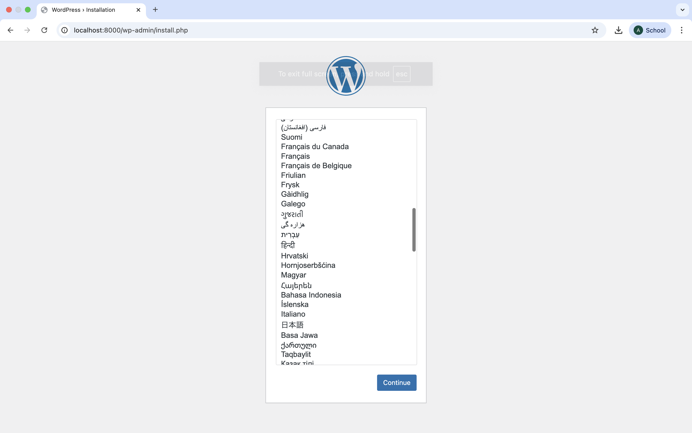
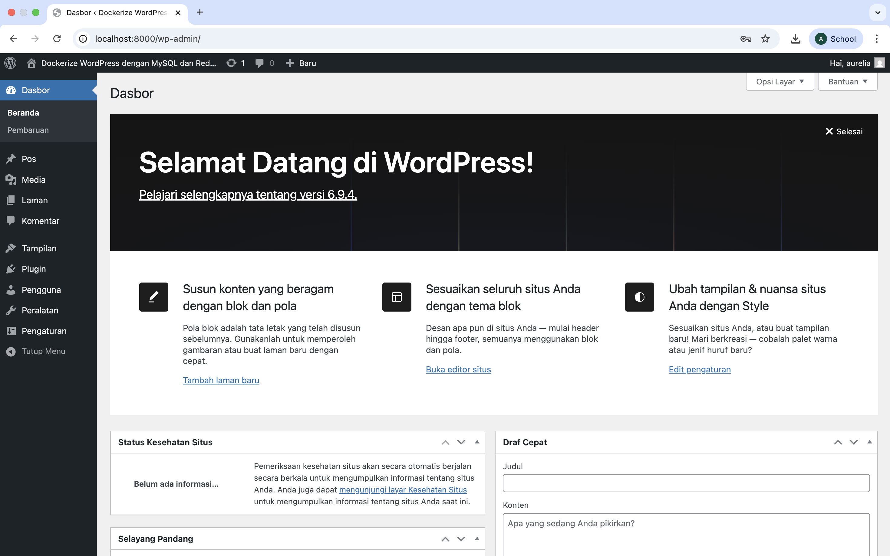
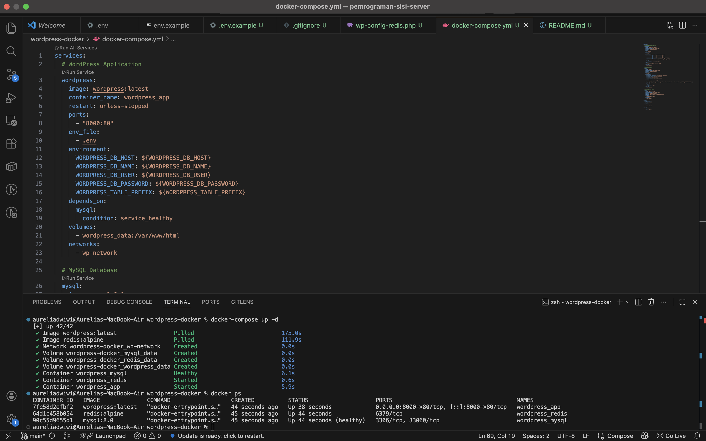
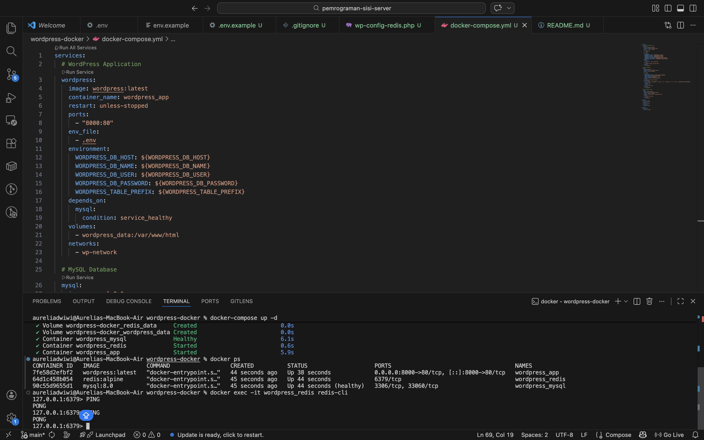
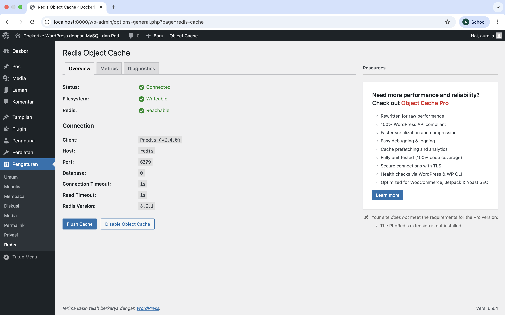

# WordPress Docker Stack

Multi-container WordPress CMS setup menggunakan Docker Compose dengan MySQL sebagai database dan Redis sebagai object cache.

## 🚀 Features

- **WordPress CMS** — Platform blogging dan CMS siap pakai berbasis PHP
- **MySQL 8.0 Database** — Penyimpanan data persisten dengan health check otomatis
- **Redis Object Cache** — In-memory cache untuk performa WordPress yang lebih cepat
- **Multi-Container Orchestration** — Semua service dikelola dengan satu file Docker Compose
- **Data Persistence** — Volume mapping memastikan data tidak hilang saat container restart
- **Custom Network** — Isolasi jaringan antar container dengan DNS resolution otomatis

## 🏗️ Architecture

```
wordpress-docker/
├── docker-compose.yml        # Konfigurasi utama multi-container stack
├── .env                      # Environment variables (tidak di-commit)
├── .env.example              # Template environment variables
├── .gitignore                # Exclude file sensitif dari Git
├── wp-config-redis.php       # Snippet konfigurasi Redis untuk wp-config.php
├── README.md
└── screenshots/
    ├── wordpress-installation.png
    ├── wordpress-dashboard.png
    ├── docker-ps.png
    ├── redis-ping.png
    └── redis-connected.png
```

## 🛠️ Tech Stack

| Layer | Technology |
|-------|-----------|
| CMS | WordPress Latest |
| Database | MySQL 8.0 |
| Object Cache | Redis Alpine |
| Orchestration | Docker Compose |
| Network | Docker Bridge Network |
| Storage | Docker Named Volumes |

## 📦 Getting Started

### Prerequisites

- Docker Desktop (sudah terinstall dan running)
- Docker Compose (sudah include di Docker Desktop)

### Quick Start

```bash
# Clone repository
git clone https://github.com/aaeilru/pemrograman-sisi-server.git
cd pemrograman-sisi-server/wordpress-docker

# Copy environment file
cp .env.example .env

# Jalankan semua services
docker-compose up -d

# Cek status container
docker-compose ps
```

Akses aplikasi:
- **WordPress:** http://localhost:8000
- **WordPress Admin:** http://localhost:8000/wp-admin

### Menghentikan Stack

```bash
# Stop semua container (data tetap tersimpan)
docker-compose down

# Stop dan hapus semua volume (data hilang!)
docker-compose down -v
```

## 🔒 Environment Variables

Lihat file `.env.example` untuk semua konfigurasi yang tersedia.

| Variable | Deskripsi |
|----------|-----------|
| `MYSQL_ROOT_PASSWORD` | Password root MySQL |
| `MYSQL_DATABASE` | Nama database WordPress |
| `MYSQL_USER` | Username database |
| `MYSQL_PASSWORD` | Password database |
| `WORDPRESS_DB_HOST` | Host MySQL (nama service) |
| `WORDPRESS_TABLE_PREFIX` | Prefix tabel WordPress |

## 🔧 Redis Object Cache Setup (Bonus)

### 1. Install Plugin

Di WordPress Dashboard → **Plugins → Add New** → cari **Redis Object Cache** → **Install Now** → **Activate**

### 2. Tambahkan Konfigurasi ke wp-config.php

Masuk ke dalam container WordPress:

```bash
docker-compose exec wordpress bash
```

Jalankan perintah `sed` berikut untuk menambahkan konfigurasi Redis secara otomatis:

```bash
sed -i "s|/\* That's all, stop editing! Happy publishing. \*/|define('WP_REDIS_HOST', 'redis');\ndefine('WP_REDIS_PORT', 6379);\n\n/* That's all, stop editing! Happy publishing. */|" /var/www/html/wp-config.php
```

Verifikasi konfigurasi sudah tersimpan:

```bash
grep -n "REDIS" /var/www/html/wp-config.php
```

Harus muncul:
```
xxx: define('WP_REDIS_HOST', 'redis');
xxx: define('WP_REDIS_PORT', 6379);
```

Keluar dari container:

```bash
exit
```

### 3. Aktifkan Object Cache

Buka browser → **Settings → Redis** → klik **Enable Object Cache**

Status akan berubah menjadi:
- ✅ Status: **Connected**
- ✅ Filesystem: **Writeable**
- ✅ Redis: **Reachable**

### 4. Verifikasi Redis via CLI

```bash
# Masuk ke Redis CLI
docker-compose exec redis redis-cli

# Test koneksi
127.0.0.1:6379> PING
PONG

# Lihat cache keys yang tersimpan
127.0.0.1:6379> KEYS *

# Keluar
127.0.0.1:6379> exit
```

## 🧪 Testing & Verifikasi

```bash
# Cek semua container running
docker ps

# Cek logs semua service
docker-compose logs -f

# Cek logs service tertentu
docker-compose logs -f wordpress
docker-compose logs -f mysql

# Masuk ke container
docker-compose exec wordpress bash
docker-compose exec mysql bash
docker-compose exec redis redis-cli
```

## 📸 Screenshots

### WordPress Installation Page


### WordPress Dashboard


### Docker PS — 3 Containers Running


### Redis CLI — PING Test


### Redis Object Cache — Connected


## ❓ Pertanyaan & Jawaban

### Kenapa perlu volume untuk MySQL?
Container Docker bersifat *ephemeral* — semua data hilang saat container dihapus. Dengan `mysql_data:/var/lib/mysql`, data MySQL disimpan di *named volume* yang dikelola Docker secara persisten di host, sehingga data tetap ada meskipun container dihentikan atau dihapus.

### Apa fungsi `depends_on`?
`depends_on` mendefinisikan urutan startup antar service. Dengan kondisi `service_healthy`, Docker Compose menunggu MySQL benar-benar siap (lolos health check) sebelum menjalankan WordPress — mencegah WordPress gagal start karena MySQL belum menerima koneksi.

### Bagaimana cara WordPress container connect ke MySQL?
Docker Compose membuat satu network (`wp-network`) dan semua service terhubung ke dalamnya. Docker menyediakan DNS resolution otomatis sehingga setiap service bisa berkomunikasi menggunakan nama service sebagai hostname. `WORDPRESS_DB_HOST: mysql:3306` menggunakan `mysql` sebagai hostname yang secara otomatis di-resolve ke IP internal container MySQL.

### Apa keuntungan pakai Redis untuk WordPress?
Redis berperan sebagai object cache in-memory yang menyimpan hasil query database di RAM. Keuntungannya: performa halaman lebih cepat, beban MySQL berkurang karena query berulang tidak perlu dieksekusi ulang, dan skalabilitas lebih baik untuk menangani traffic tinggi.

## 🔍 Troubleshooting

| Masalah | Solusi |
|---------|--------|
| MySQL tidak start | Cek environment variables di `.env`, pastikan `MYSQL_ROOT_PASSWORD` terisi |
| WordPress tidak connect ke MySQL | Pastikan `WORDPRESS_DB_HOST=mysql:3306`, gunakan nama service bukan IP |
| Data hilang setelah restart | Pastikan volumes terdefinisi, jangan gunakan `docker-compose down -v` |
| Port 8000 sudah dipakai | Ubah ke `"8080:80"` di `docker-compose.yml`, akses di `localhost:8080` |
| Container langsung exit | Jalankan `docker-compose logs [nama_service]` untuk debug |
| Redis Unreachable | Pastikan `define('WP_REDIS_HOST', 'redis')` sudah ada di `wp-config.php` |
| Error `mysql:5.7` di Apple Silicon | Ganti ke `mysql:8.0` — mysql:5.7 tidak support ARM64 |

---

*Tugas Mata Kuliah Pemrograman Sisi Server — Universitas Dian Nuswantoro*  